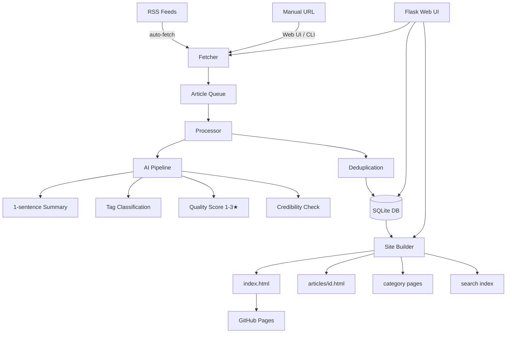

# Folio

<p align="center">
  
  
  
  
  
  
</p>

<p align="center">
  <b>WeChat Public Account articles → Personal Knowledge Base</b><br>
  Not just a feed reader. A knowledge distillation engine powered by AI.
</p>

---

## ✨ Features

- 📥 **Dual ingestion**: RSS auto-fetch (via Wechat2RSS/wewe-rss) + manual URL submission
- 🤖 **Multi-model AI**: OpenAI · Claude · Qwen (通义千问) · Gemini — swap via config
- 🏷️ **Smart tagging**: Type (干货/新闻/广告/观点) + Topic (AI/产品/技术) labels
- ⭐ **Quality scoring**: 1–3 star rating per article
- 🛡️ **Credibility check**: Flags clickbait and exaggerated claims
- 🔍 **Full-text search**: Client-side Fuse.js, zero backend
- 🌙 **Dark/Light theme**: Auto-detects system preference
- 📄 **Static HTML output**: Deploy to GitHub Pages or open locally
- 🧹 **Deduplication**: URL + title similarity dedup
- 🔄 **GitHub Actions**: Auto-fetch → build → deploy every hour
- 💻 **Local Web UI**: Flask admin panel at `localhost:8080`
- 🗄️ **Zero dependencies**: SQLite only, no external services required

## 🏗️ Architecture



## 🚀 Quick Start

### 1. Clone & Install

```bash
git clone https://github.com/yourusername/Folio.git
cd Folio
python -m venv venv
source venv/bin/activate  # Windows: venv\Scripts\activate
pip install -r requirements.txt
```

### 2. Configure

```bash
cp config.example.yaml config.yaml
```

Edit `config.yaml` — at minimum set your AI provider:

```yaml
ai:
  provider: qwen    # or: openai | claude | gemini
  qwen:
    api_key: "sk-your-key-here"
    model: "qwen-turbo"
```

### 3. Add Articles

**Option A — Manual URL (fastest to test):**
```bash
python cli.py add-url "https://mp.weixin.qq.com/s/your-article-url"
```

**Option B — RSS Feed:**
```bash
python cli.py add-rss "https://your-rss-service/feed" --name "公众号名称"
python cli.py fetch
```

**Option C — Web UI:**
```bash
python app.py
# Open http://localhost:8080
```

### 4. Build & Preview

```bash
python cli.py build
python cli.py serve
# Open http://localhost:8000
```

## 📖 CLI Reference

```
python cli.py [COMMAND] [OPTIONS]

Commands:
  add-url    Add article by URL and process immediately
  add-rss    Add RSS subscription feed
  fetch      Fetch new articles from all RSS feeds
  build      Generate static HTML site
  serve      Serve the generated site locally
  list       List all articles in the database
  stats      Show database statistics
```

### Examples

```bash
# Add a single article
python cli.py add-url "https://mp.weixin.qq.com/s/xxxx"

# Add RSS feed
python cli.py add-rss "https://wechat2rss.xlab.app/feed/xxx" --name "科技早报"

# Fetch all feeds
python cli.py fetch

# Build site
python cli.py build

# Serve locally on port 8000
python cli.py serve --port 8000

# Show stats
python cli.py stats
```

## ⚙️ Configuration Reference

| Key | Default | Description |
|-----|---------|-------------|
| `ai.provider` | `qwen` | Active AI provider |
| `ai.qwen.api_key` | — | Qwen API key |
| `ai.qwen.model` | `qwen-turbo` | Model name |
| `rss.fetch_interval` | `60` | Fetch interval (minutes) |
| `rss.max_articles_per_feed` | `20` | Max articles per fetch |
| `site.output_dir` | `site` | Output directory |
| `site.base_url` | `""` | Base URL for GitHub Pages |
| `site.articles_per_page` | `50` | Pagination size |
| `processing.title_similarity_threshold` | `0.85` | Dedup threshold |
| `web.port` | `8080` | Flask UI port |

### Supported AI Models

| Provider | Models | Notes |
|----------|--------|-------|
| **Qwen** | `qwen-turbo`, `qwen-plus`, `qwen-max` | Best for Chinese content |
| **OpenAI** | `gpt-4o`, `gpt-4o-mini`, `gpt-3.5-turbo` | Most capable |
| **Claude** | `claude-3-5-sonnet-20241022`, `claude-3-5-haiku-20241022` | High quality |
| **Gemini** | `gemini-1.5-pro`, `gemini-1.5-flash` | Google's models |

## 🚢 Deploy to GitHub Pages

### Manual Deploy

```bash
# Build the site
python cli.py build

# Push to gh-pages branch
git subtree push --prefix site origin gh-pages
```

### Automatic Deploy (GitHub Actions)

1. Fork this repository
2. Go to **Settings → Secrets → Actions**, add:
   - `QWEN_API_KEY` (or your chosen provider's key)
   - `RSS_FEED_URLS` (comma-separated RSS URLs, optional)
3. Go to **Settings → Pages**, set source to `gh-pages` branch
4. The workflow runs every hour automatically

See [`.github/workflows/auto-fetch.yml`](.github/workflows/auto-fetch.yml) for details.

## 🔧 RSS Service Setup

Folio requires a third-party service to convert WeChat public accounts to RSS:

| Service | Description | URL |
|---------|-------------|-----|
| **Wechat2RSS** | Self-hosted, free | [xlab.app](https://wechat2rss.xlab.app) |
| **wewe-rss** | Open source, Docker | [GitHub](https://github.com/cooderl/wewe-rss) |
| **RSSHub** | Universal RSS hub | [rsshub.app](https://rsshub.app) |

## 📁 Project Structure

```
Folio/
├── README.md                    # This file
├── README_CN.md                 # Chinese documentation
├── LICENSE                      # MIT License
├── pyproject.toml               # Package metadata
├── requirements.txt             # Python dependencies
├── config.example.yaml          # Configuration template
├── cli.py                       # CLI entry point
├── app.py                       # Flask Web UI entry point
├── wesum/
│   ├── __init__.py              # Package init
│   ├── config.py                # Configuration loader
│   ├── database.py              # SQLite ORM layer
│   ├── fetcher.py               # RSS + article scraper
│   ├── ai/
│   │   ├── __init__.py          # AI provider factory
│   │   ├── base.py              # Abstract base class
│   │   ├── openai_provider.py   # OpenAI implementation
│   │   ├── claude_provider.py   # Anthropic Claude implementation
│   │   ├── qwen_provider.py     # Alibaba Qwen implementation
│   │   └── gemini_provider.py   # Google Gemini implementation
│   ├── processor.py             # Article processing pipeline
│   ├── builder.py               # Static HTML generator
│   └── dedup.py                 # Deduplication engine
├── web/
│   ├── templates/               # Jinja2 templates for Flask UI
│   └── static/                  # Flask UI static assets
├── site/                        # Generated static HTML output
├── data/                        # SQLite database + logs
└── .github/workflows/
    └── auto-fetch.yml           # GitHub Actions workflow
```

## 🤝 Contributing

1. Fork the repository
2. Create a feature branch: `git checkout -b feat/amazing-feature`
3. Commit your changes: `git commit -m 'feat: add amazing feature'`
4. Push to the branch: `git push origin feat/amazing-feature`
5. Open a Pull Request

## ❓ FAQ

**Q: Can I use this without an AI API key?**
> A: No — AI processing (summary, tags, scoring) requires an API key. Qwen (通义千问) offers a generous free tier and works best for Chinese content.

**Q: Does this store article content locally?**
> A: Yes, full article text is stored in SQLite. Detailed summaries are cached on first access.

**Q: How does it handle paywalled WeChat articles?**
> A: Standard WeChat articles are publicly accessible. Login-required content cannot be fetched.

**Q: Can I add non-WeChat articles?**
> A: Yes! Any publicly accessible article URL works with `add-url`.

**Q: How do I update an existing article's summary?**
> A: Delete it from the DB and re-add. Or modify `wesum/database.py` to add a `--force` refresh flag.

**Q: What's the token cost per article?**
> A: ~500-1500 tokens for initial processing (summary + tags + score). Detailed page generation: ~2000-4000 tokens. With `qwen-turbo`, cost is negligible.

## 📜 License

MIT License — see [LICENSE](LICENSE) for details.

---

<p align="center">Built with ❤️ for knowledge workers who want to tame their reading list.</p>
